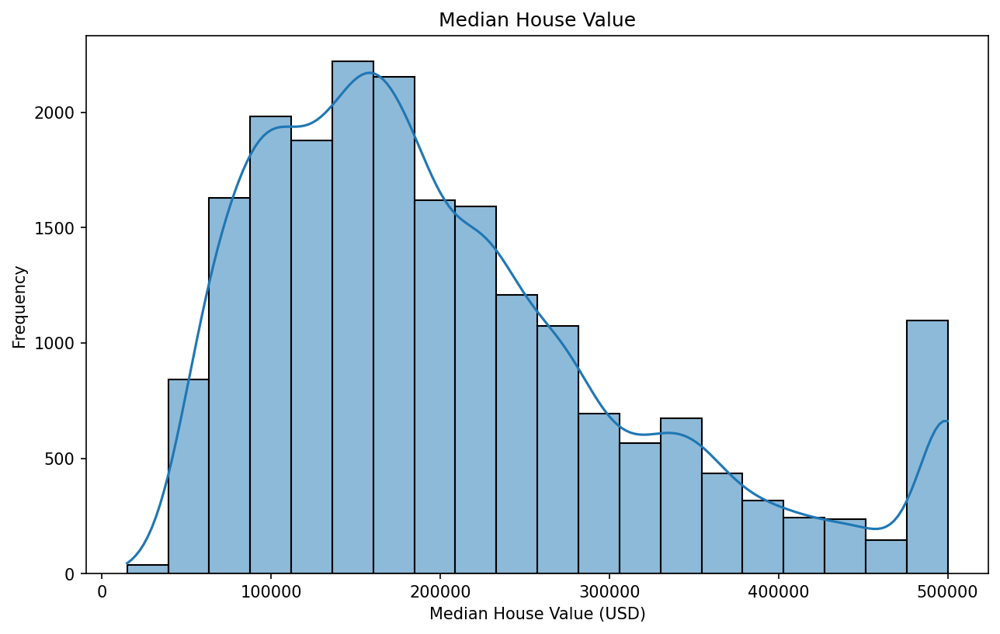
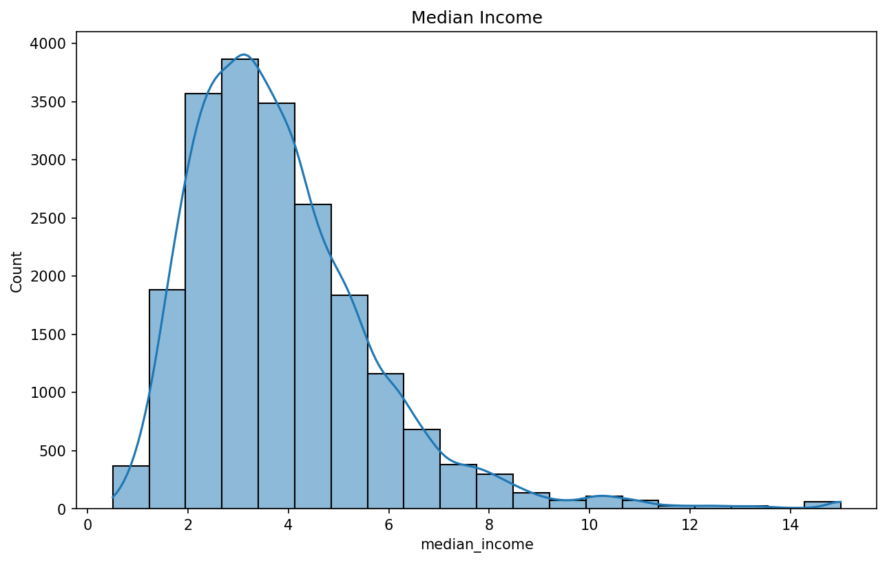
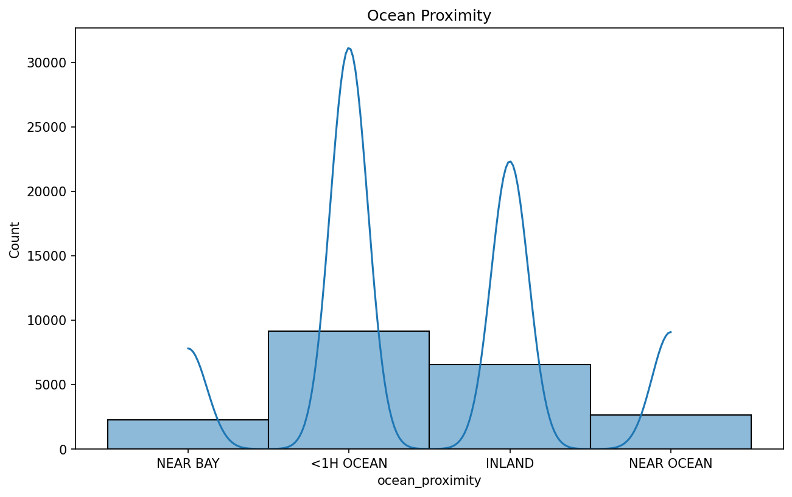
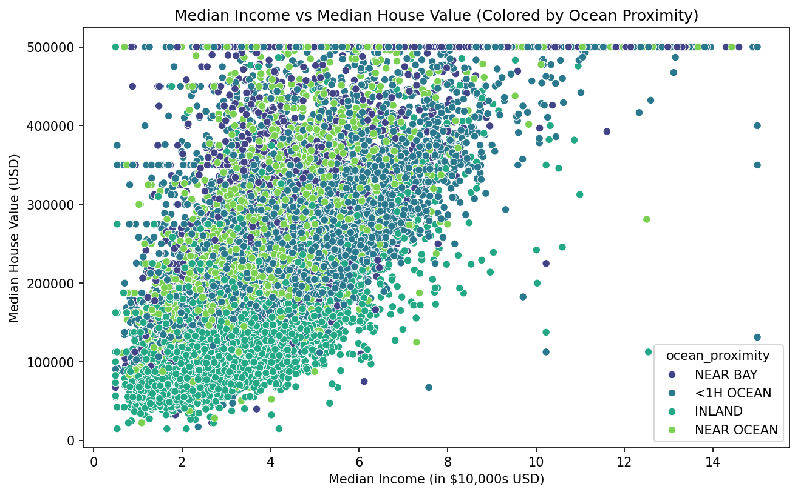
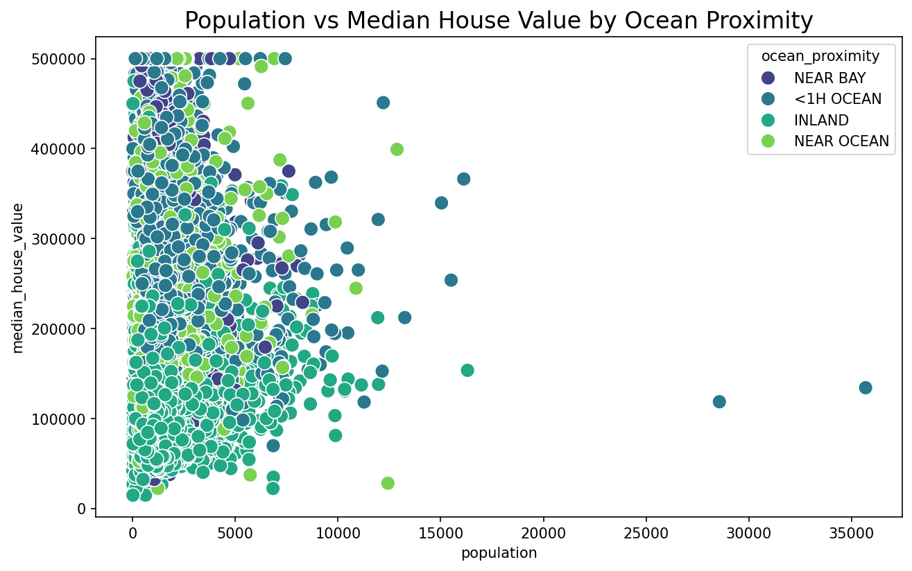
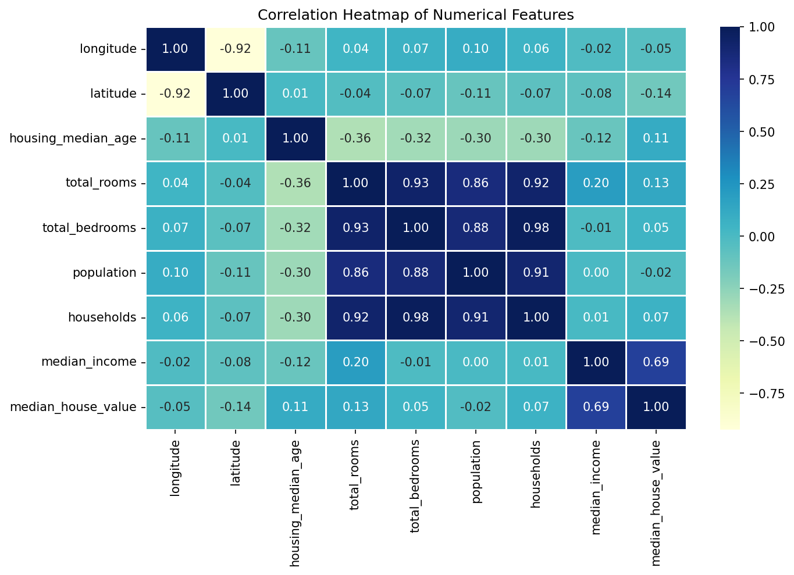

# Python California Housing Prices Data Analysis

Created in Google Colab.

**Data Source**: https://www.kaggle.com/datasets/camnugent/california-housing-prices

In this analysis, file "housing.csv" is evaluated and processed.
The housing data evaluated is taken from the 1990 California census.
First, a correlation between median_housing_price and other variables is established, allowing us to determine which variable correlates most with median_housing_price.

General data analysis and validtaion is done to visualize and clean the data.

A histogram is done to visualize median house prices which can be visualzied at right-skewed.

Median income is analyzed showing another right-skewed distribution.

Ocean proximity of the data set is anaylzed showing a multimodal distribution.

This aims to explore the relationship between median_income (on the x-axis) and median_house_value (on the y-axis), while differentiating points based on the ocean_proximity feature.

This scatter plot visualizes the relationship between population (on the x-axis) and median_house_value (on the y-axis), with each point again colored by ocean_proximity.

This heatmap visualizes the correlation matrix for all the numerical features in the dataset. The correlation matrix is computed to understand how each numerical variable (e.g., median_income, households, population) is correlated with others.

This heatmap is similar to the previous one, but this time, it includes the ocean_proximity feature, which has been one-hot encoded (i.e., converted into binary variables for each category of proximity to the ocean). This encoding allows us to analyze the correlation of ocean proximity with other numerical features in the dataset.

## Conclusion

Through the analysis of correlation metrics, we can uncover several significant relationships within the dataset, providing valuable insights into the factors that influence house prices. One of the most notable trends is that properties located closer to the ocean tend to have higher house values and are situated in areas with higher median incomes. This correlation suggests that ocean proximity is a key determinant of property value, likely due to the desirability of coastal locations, scenic views, and the potential for recreational opportunities. Additionally, areas near the ocean tend to attract higher-income residents, possibly due to the premium on housing in these regions.

Beyond ocean proximity, there is a strong positive correlation between several other variables. Median house values, median income, population density, and the number of total rooms in a house all show significant interrelationships. For example, as median income in a given area increases, it is often accompanied by higher house values, larger homes, and a more populated neighborhood. This suggests that wealthier regions tend to have larger, more expensive homes, often with more rooms to accommodate larger households or higher standards of living.

On the other hand, inland properties exhibit a strong negative correlation with median house values. This indicates that homes located farther from the coast, typically in more rural or less desirable areas, tend to have lower market values. The reduced desirability of inland locations, possibly due to limited access to coastal amenities and scenic landscapes, is a key factor contributing to this trend.

By leveraging these correlations, we can use this data to build a predictive model. Using machine learning techniques, we can train a model to predict house values based on these key factors such as proximity to the ocean, median income, population density, and the number of rooms. The trained model could provide valuable insights for real estate investors, homebuyers, and urban planners, helping them understand how different variables interact to influence property values. Ultimately, this approach allows for more accurate and data-driven predictions, facilitating smarter decision-making in the real estate market.
