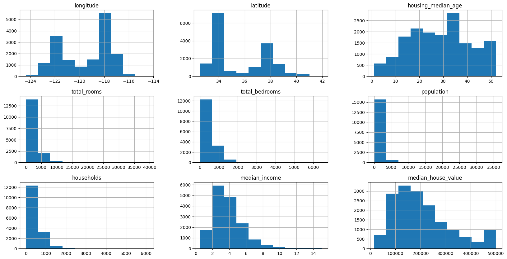
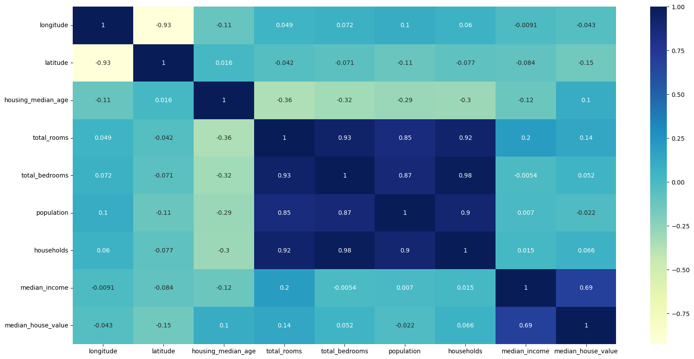

# PY California Housing Prices Data Analysis

Created in Google Colab.

Data Set: https://www.kaggle.com/datasets/camnugent/california-housing-prices

In this model, checkpoint "housing.csv" is evaluated and processed.
The housing data evaluated is taken from the 1990 California census.
First, a correlation between median_housing_price and other variables is established, allowing us to determine which variable correlates most with median_housing_price.

General data analysis and validtaion is done:

A histogram is done to visualize median house prices which can be visualzied at right-skewed.

Median income is analyzed showing another right-skewed distribution.

Ocean proximity of the data set is anaylzed showing a multimodal distribution.

Aims to explore the relationship between median_income (on the x-axis) and median_house_value (on the y-axis), while differentiating points based on the ocean_proximity feature.

This scatter plot visualizes the relationship between population (on the x-axis) and median_house_value (on the y-axis), with each point again colored by ocean_proximity.

This heatmap visualizes the correlation matrix for all the numerical features in the dataset. The correlation matrix is computed to understand how each numerical variable (e.g., median_income, households, population) is correlated with others.

This heatmap is similar to the previous one, but this time, it includes the ocean_proximity feature, which has been one-hot encoded (i.e., converted into binary variables for each category of proximity to the ocean). This encoding allows us to analyze the correlation of ocean proximity with other numerical features in the dataset.

The variables are per block, so from this data, we can determine that on average, there are approximately 34 bedrooms in a house.

Since there are negative values present in the data, we perform data.dropna(inplace=True).

Looking at a sns.heatmap, we can better visualize correaltions between variabls.

Aftering processing the data, we are able to visualize the ocean_promiximity to median_house_price. A slight positive correlation is seen to median_house_price if a house is closer to a ocean/bay.

Here is the above data dispalyed in a cluster map.

## Conclusion

Through the anaylsis of correlation metrics multiple relationships can be drawn from this data. The closer a house is to an ocean, the house its house value and the median income of the area.
